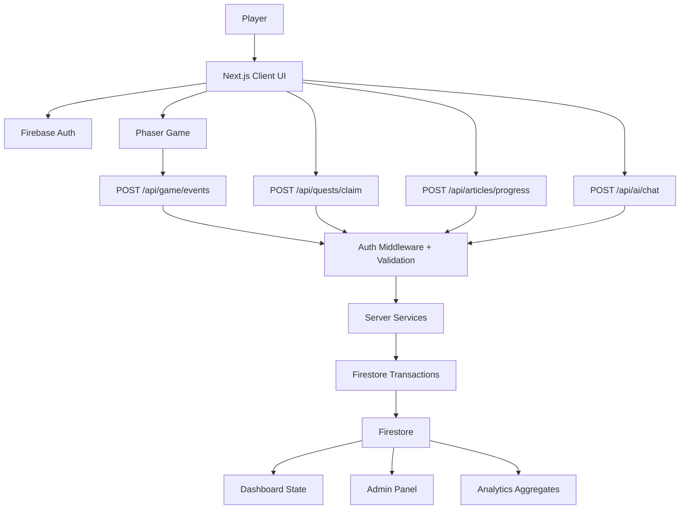
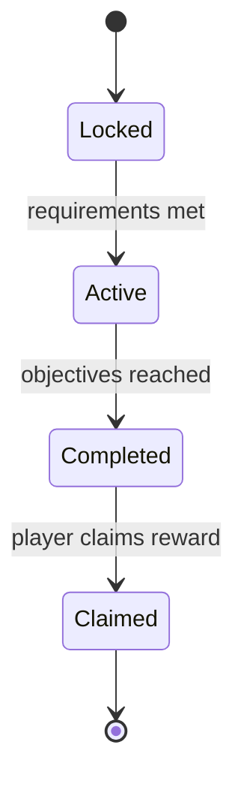
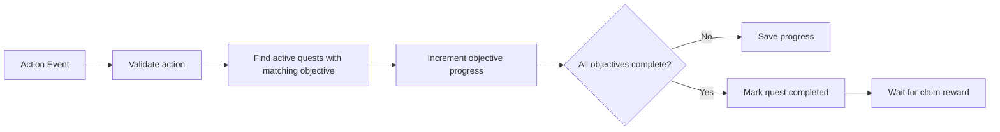
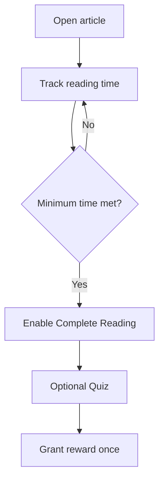

# EcoQuest Production-Ready MVP Architecture

Dokumen ini adalah blueprint redesign EcoQuest agar lebih profesional, scalable, aman, dan menarik secara gameplay. Targetnya realistis untuk project lomba atau production-ready MVP.

## 1. Executive Summary

EcoQuest sebaiknya bergerak dari pola "client memberi poin" menjadi pola "client melaporkan event". Semua reward, XP, quest progress, badge, dan analytics dihitung di server melalui API route yang tervalidasi, memakai Firebase Admin SDK dan Firestore transaction.

Prinsip utama:

- Client hanya mengirim aksi, bukan reward.
- Server menentukan reward berdasarkan konfigurasi quest, action registry, cooldown, dan state user.
- Semua perubahan kritikal memakai transaction.
- Firestore schema dipisah antara master data, user state, event log, dan aggregate analytics.
- Phaser game tidak menjadi sumber kebenaran reward; game hanya UI dan event emitter.
- Admin panel mengelola quest, artikel, achievement, dan monitoring anti-cheat.

## 2. Target Architecture



Recommended layers:

- `app`: routing, pages, route handlers.
- `features`: feature-specific UI and hooks.
- `server`: server-only services, validators, reward engine, anti-cheat.
- `domain`: shared constants, schemas, types.
- `lib`: Firebase initialization and generic helpers.

## 3. New Folder Structure

```txt
src/
  app/
    api/
      game/events/route.js
      quests/route.js
      quests/claim/route.js
      articles/route.js
      articles/progress/route.js
      ai/chat/route.js
      admin/quests/route.js
      admin/articles/route.js
      admin/users/route.js
      analytics/summary/route.js
    admin/
      layout.js
      page.js
      users/page.js
      quests/page.js
      articles/page.js
      analytics/page.js
      suspicious/page.js
    dashboard/page.js
    education/page.js
    game/page.js
    login/page.js
    register/page.js
    layout.js
  components/
    ui/
    layout/
  domain/
    actions.js
    rewards.js
    quests.js
    achievements.js
    levels.js
  features/
    auth/
      AuthProvider.jsx
      useAuth.js
    game/
      GameCanvas.jsx
      InventoryPanel.jsx
      RewardPopup.jsx
      useGameEvents.js
    quests/
      QuestBoard.jsx
      QuestCard.jsx
      useQuests.js
    education/
      ArticleList.jsx
      ArticleReader.jsx
      QuizPanel.jsx
      useArticles.js
    ai/
      EcoAssistant.jsx
      useConversation.js
    admin/
      AdminShell.jsx
      StatsCards.jsx
      SuspiciousPlayersTable.jsx
  lib/
    firebase/
      client.js
      admin.js
    firestore/
      converters.js
    validation.js
    time.js
  server/
    auth/
      requireUser.js
      requireAdmin.js
    antiCheat/
      cooldown.js
      suspiciousScore.js
    rewards/
      rewardEngine.js
      levelEngine.js
      achievementEngine.js
    quests/
      questEngine.js
      progressEngine.js
    inventory/
      inventoryEngine.js
    analytics/
      analyticsEngine.js
```

## 4. Firestore Schema

### Master Collections

```txt
quests/{questId}
  type: "main" | "side" | "daily" | "weekly" | "event"
  title: string
  description: string
  difficulty: "easy" | "medium" | "hard" | "legendary"
  objectives: [
    {
      id: string
      action: "COLLECT_TRASH" | "READ_ARTICLE" | "COMPLETE_QUIZ" | "TALK_NPC"
      target: number
      filters?: { trashType?: string, articleCategory?: string, npcId?: string }
    }
  ]
  reward: { ecoPoints: number, xp: number, items?: [], badges?: [] }
  requirements: { minLevel?: number, questIds?: [] }
  startsAt?: timestamp
  endsAt?: timestamp
  isActive: boolean
  createdAt: timestamp
  updatedAt: timestamp

achievements/{achievementId}
  title: string
  description: string
  hidden: boolean
  rarity: "common" | "rare" | "epic" | "legendary"
  objective: { action: string, target: number, filters?: object }
  reward: { ecoPoints: number, xp: number, badgeId?: string }
  isActive: boolean

articles/{articleId}
  title: string
  slug: string
  category: string
  summary: string
  content: string
  quizIds: string[]
  readingReward: { ecoPoints: number, xp: number }
  minReadSeconds: number
  isPublished: boolean
  createdAt: timestamp
  updatedAt: timestamp

quizzes/{quizId}
  articleId: string
  questions: [
    {
      id: string
      question: string
      options: string[]
      answerIndex: number
      explanation: string
    }
  ]
  reward: { ecoPoints: number, xp: number }
```

### User State

```txt
users/{uid}
  uid: string
  displayName: string
  email: string
  role: "user" | "admin"
  level: number
  title: string
  currentXP: number
  totalEcoPoints: number
  trashCollected: number
  suspiciousScore: number
  createdAt: timestamp
  lastActive: timestamp

users/{uid}/questProgress/{questId}
  questId: string
  type: string
  status: "locked" | "active" | "completed" | "claimed"
  objectives: {
    [objectiveId]: { current: number, target: number, completed: boolean }
  }
  completedAt?: timestamp
  claimedAt?: timestamp
  cycleKey?: "2026-05-07" | "2026-W19"

users/{uid}/inventory/{itemId}
  itemId: string
  type: "trash" | "material" | "tool" | "cosmetic"
  rarity: "common" | "uncommon" | "rare" | "epic"
  quantity: number
  updatedAt: timestamp

users/{uid}/achievements/{achievementId}
  achievementId: string
  status: "in_progress" | "unlocked" | "claimed"
  progress: number
  target: number
  unlockedAt?: timestamp

users/{uid}/articleProgress/{articleId}
  articleId: string
  readingSeconds: number
  completed: boolean
  rewardClaimed: boolean
  bookmarked: boolean
  quizScore?: number
  updatedAt: timestamp

users/{uid}/conversations/{conversationId}
  title: string
  summary: string
  createdAt: timestamp
  updatedAt: timestamp

users/{uid}/conversations/{conversationId}/messages/{messageId}
  role: "user" | "assistant"
  content: string
  createdAt: timestamp
```

### Event Log and Analytics

```txt
gameEvents/{eventId}
  uid: string
  action: string
  metadata: object
  reward: { ecoPoints: number, xp: number }
  accepted: boolean
  reason?: string
  createdAt: timestamp

analyticsDaily/{date}
  activeUsers: number
  questsCompleted: number
  trashCollected: number
  articlesRead: number
  aiMessages: number
  updatedAt: timestamp

leaderboard/current
  topUsers: [
    { uid: string, displayName: string, totalEcoPoints: number, level: number }
  ]
  updatedAt: timestamp
```

## 5. API Design

All protected API routes should use Firebase ID token verification.

```txt
POST /api/game/events
Body:
  { action: "COLLECT_TRASH", metadata?: { trashType, areaId, clientEventId } }
Server:
  validate auth, action, cooldown, event uniqueness, area unlock
  calculate reward
  update user, inventory, quest progress, achievements, analytics in transaction

GET /api/quests
Response:
  available quests + user progress

POST /api/quests/claim
Body:
  { questId: string }
Server:
  verify quest completed and not claimed
  grant reward in transaction

GET /api/articles
Response:
  published articles

POST /api/articles/progress
Body:
  { articleId, readingSecondsDelta, completed?: boolean, bookmark?: boolean }
Server:
  validate min read time before reward

POST /api/articles/quiz
Body:
  { articleId, quizId, answers: number[] }
Server:
  calculate score and reward if pass threshold

POST /api/ai/chat
Body:
  { conversationId?, message: string }
Server:
  load memory summary, user stats, recent activity
  call GROQ
  persist message and summary

GET /api/admin/analytics
Admin only.

POST /api/admin/quests
Admin only. Create/update quest master data.
```

## 6. Security Design

### Required Improvements

- Do not trust `userId` from request body. Use UID from verified Firebase ID token.
- Do not trust `points` from client. Server maps action to reward.
- Use schema validation for every request body.
- Add cooldown per action.
- Add idempotency with `clientEventId`.
- Use Firestore transaction for reward, quest progress, inventory, and achievements.
- Add role-based access for admin panel.
- Log rejected events for anti-cheat analysis.

### Suggested Cooldowns

```js
export const ACTION_RULES = {
  COLLECT_TRASH: {
    ecoPoints: 10,
    xp: 10,
    cooldownMs: 800,
    dailyLimit: 500,
  },
  TALK_NPC: {
    ecoPoints: 2,
    xp: 2,
    cooldownMs: 10_000,
    dailyLimit: 50,
  },
  READ_ARTICLE: {
    ecoPoints: 15,
    xp: 15,
    cooldownMs: 60_000,
    dailyLimit: 20,
  },
  COMPLETE_QUIZ: {
    ecoPoints: 30,
    xp: 30,
    cooldownMs: 30_000,
    dailyLimit: 20,
  },
};
```

### Firebase Rules Direction

Client should read safe public data and own user state. Critical writes should go through API routes.

```js
match /users/{userId} {
  allow read: if request.auth != null && request.auth.uid == userId;
  allow update: if false;
}

match /quests/{questId} {
  allow read: if true;
  allow write: if request.auth != null && get(/databases/$(database)/documents/users/$(request.auth.uid)).data.role == "admin";
}
```

## 7. Reward Engine Example

```js
// src/server/rewards/rewardEngine.js
import { FieldValue } from "firebase-admin/firestore";
import { ACTION_RULES } from "@/domain/actions";

export async function processActionEvent({ db, uid, action, metadata, now }) {
  const rule = ACTION_RULES[action];
  if (!rule) {
    return { accepted: false, reason: "UNKNOWN_ACTION" };
  }

  const userRef = db.collection("users").doc(uid);
  const eventRef = db.collection("gameEvents").doc(metadata.clientEventId);
  const cooldownRef = userRef.collection("cooldowns").doc(action);

  return db.runTransaction(async (tx) => {
    const [userSnap, eventSnap, cooldownSnap] = await Promise.all([
      tx.get(userRef),
      tx.get(eventRef),
      tx.get(cooldownRef),
    ]);

    if (!userSnap.exists) return { accepted: false, reason: "USER_NOT_FOUND" };
    if (eventSnap.exists) return { accepted: false, reason: "DUPLICATE_EVENT" };

    const lastAt = cooldownSnap.data()?.lastAt?.toMillis?.() || 0;
    if (now.getTime() - lastAt < rule.cooldownMs) {
      tx.set(eventRef, {
        uid,
        action,
        metadata,
        accepted: false,
        reason: "COOLDOWN",
        createdAt: FieldValue.serverTimestamp(),
      });
      return { accepted: false, reason: "COOLDOWN" };
    }

    tx.update(userRef, {
      totalEcoPoints: FieldValue.increment(rule.ecoPoints),
      currentXP: FieldValue.increment(rule.xp),
      trashCollected:
        action === "COLLECT_TRASH" ? FieldValue.increment(1) : FieldValue.increment(0),
      lastActive: FieldValue.serverTimestamp(),
    });

    tx.set(cooldownRef, { lastAt: FieldValue.serverTimestamp() }, { merge: true });
    tx.set(eventRef, {
      uid,
      action,
      metadata,
      reward: { ecoPoints: rule.ecoPoints, xp: rule.xp },
      accepted: true,
      createdAt: FieldValue.serverTimestamp(),
    });

    return { accepted: true, reward: { ecoPoints: rule.ecoPoints, xp: rule.xp } };
  });
}
```

## 8. Auth Middleware Example

```js
// src/server/auth/requireUser.js
import { NextResponse } from "next/server";
import { adminAuth } from "@/lib/firebase/admin";

export async function requireUser(request) {
  const authHeader = request.headers.get("authorization") || "";
  const token = authHeader.startsWith("Bearer ") ? authHeader.slice(7) : null;

  if (!token) {
    return { error: NextResponse.json({ error: "Unauthorized" }, { status: 401 }) };
  }

  try {
    const decoded = await adminAuth.verifyIdToken(token);
    return { uid: decoded.uid, decoded };
  } catch {
    return { error: NextResponse.json({ error: "Invalid token" }, { status: 401 }) };
  }
}
```

Client request example:

```js
const token = await auth.currentUser.getIdToken();
await fetch("/api/game/events", {
  method: "POST",
  headers: {
    "Content-Type": "application/json",
    Authorization: `Bearer ${token}`,
  },
  body: JSON.stringify({
    action: "COLLECT_TRASH",
    metadata: {
      trashType: "plastic",
      areaId: "starter_park",
      clientEventId: crypto.randomUUID(),
    },
  }),
});
```

## 9. Quest System Redesign

Quest lifecycle:



Event validation flow:



Quest objective examples:

```js
{
  id: "daily_cleaner_1",
  type: "daily",
  title: "Bersihkan Taman Kota",
  objectives: [
    {
      id: "collect_plastic",
      action: "COLLECT_TRASH",
      target: 5,
      filters: { trashType: "plastic", areaId: "starter_park" }
    }
  ],
  reward: { ecoPoints: 50, xp: 50 },
  difficulty: "easy"
}
```

## 10. Gameplay Improvements

### Inventory System

Trash types:

- `plastic_bottle`: common, recycle to plastic material.
- `paper`: common, recycle to paper material.
- `metal_can`: uncommon, recycle to metal material.
- `battery`: rare, hazardous waste, requires special bin.
- `glass_bottle`: uncommon, recycle to glass material.

UI:

- Inventory drawer in game page.
- Material counters.
- Recycling station modal.
- Item rarity color.

### Dynamic World

Area cleanliness score:

```txt
worldAreas/{areaId}
  name
  requiredLevel
  cleanlinessScore
  pollutionLevel
  unlockedByQuestId
```

Gameplay effect:

- Dirty area: darker map, more trash spawn, NPC dialogue warns user.
- Clean area: brighter map, flowers/trees appear, unlock quest or badge.

### NPC Interaction

```txt
npcs/{npcId}
  name
  role: "guide" | "quest_giver" | "shop" | "story"
  areaId
  dialogueTree
  questIds
```

NPC should emit `TALK_NPC` action and can unlock quest chains.

### Progression

- Level 1: Starter Park.
- Level 3: River Area.
- Level 5: Recycling Center.
- Level 7: Industrial Zone.
- Level 10: Gaia Sanctuary.

## 11. Achievement and Badge System

Achievement examples:

```txt
collector_100
  title: Master Kolektor
  objective: COLLECT_TRASH target 100
  rarity: rare
  reward: badge collector_gold + 100 XP

reader_5
  title: Eco Scholar
  objective: READ_ARTICLE target 5
  rarity: common

secret_battery
  title: Hazard Hero
  hidden: true
  objective: COLLECT_TRASH target 1 filter trashType=battery
  rarity: epic
```

Best practice:

- Store master achievement in `achievements`.
- Store user progress in `users/{uid}/achievements`.
- Update progress from same action event pipeline.
- Hidden achievement appears only after unlocked.

## 12. Education Hub Improvement

Minimum MVP:

- Replace hardcoded articles with Firestore `articles`.
- Add admin CRUD for articles.
- Add reading timer.
- Add bookmark.
- Add quiz per article.
- Reward article only once after `minReadSeconds`.

Reader flow:



## 13. AI Companion Improvement

EcoAssistant should use:

- User profile: level, XP, quests, badges.
- Recent activity: trash collected, articles read, unfinished quests.
- Conversation summary memory.
- Recommendation engine.

Use cases:

- "Hari ini kamu belum menyelesaikan misi hemat air."
- "Karena kamu sering mengumpulkan plastik, coba baca artikel zero waste."
- "Aku buatkan misi personal: kumpulkan 3 sampah kertas di area sekolah."

Important guardrails:

- AI may suggest missions, but server must approve and create them.
- AI should not grant rewards directly.
- Conversation history should be capped and summarized.

## 14. Admin Panel

Admin pages:

- Overview: active users, trash collected, quest completion.
- Users: profile, role, suspicious score, ban/flag.
- Quests: CRUD quest master data.
- Articles: CMS editor, publish/unpublish.
- Analytics: charts by day/week.
- Suspicious players: high event frequency, impossible progress, duplicate events.
- Leaderboard: rebuild and moderate entries.

Access:

- `users/{uid}.role === "admin"`.
- Server-side `requireAdmin`.
- Hide admin nav on client, but enforce on server.

## 15. Analytics System

Events to track:

- `LOGIN`
- `SESSION_START`
- `SESSION_END`
- `COLLECT_TRASH`
- `QUEST_COMPLETED`
- `QUEST_CLAIMED`
- `READ_ARTICLE`
- `COMPLETE_QUIZ`
- `AI_MESSAGE`

For MVP, update `analyticsDaily/{date}` with increments inside relevant transactions. For later scale, use scheduled Cloud Function aggregation.

Dashboard metrics:

- Daily active users.
- Quest completion rate.
- Trash collected by type.
- Most active players.
- Average session duration.
- AI usage count.

## 16. UI/UX Recommendations

Design direction:

- Keep dark pixel eco style, but reduce visual noise.
- Use a dashboard that feels like a game command center.
- Make rewards tactile: popup, sound toggle, confetti-lite animation.
- Use level progress as first-class UI.
- On mobile, keep game controls thumb-friendly.

Screens to improve:

- Dashboard: add "Today Journey" panel with active quests and quick progress.
- Game: add inventory drawer, minimap/area status, NPC dialogue modal.
- Education: card grid + reader view + quiz.
- Admin: dense modern table, filters, charts, suspicious badges.

Reward UX:

- `+10 EP` floating toast.
- Level-up modal with new title and unlocks.
- Badge unlock animation.
- Quest completed panel with claim button.

## 17. Step-by-Step Implementation Plan

Phase 1: Security foundation

1. Add Firebase Admin helper.
2. Add `requireUser` and `requireAdmin`.
3. Replace `/api/quest` with `/api/game/events`.
4. Implement action registry and reward engine.
5. Add cooldown and idempotency.
6. Update Phaser client to send action only.

Phase 2: Quest engine

1. Create `quests` master schema.
2. Seed main/daily/weekly quests.
3. Create `questEngine`.
4. Update progress from event pipeline.
5. Add reward claim API.
6. Update dashboard quest UI.

Phase 3: Education

1. Move articles to Firestore.
2. Add article progress subcollection.
3. Add reading timer and bookmark.
4. Add quiz schema and quiz UI.
5. Add admin article CRUD.

Phase 4: Gameplay

1. Add trash types and metadata.
2. Add inventory subcollection.
3. Add recycling station UI.
4. Add area cleanliness state.
5. Add NPC dialogue and quest giver.

Phase 5: Achievement and AI

1. Add achievement master data.
2. Update achievement progress from events.
3. Add conversation history.
4. Add AI recommendations.
5. Add AI-generated mission proposal flow.

Phase 6: Admin and analytics

1. Add admin route group.
2. Add role-based access.
3. Add analytics aggregates.
4. Add suspicious players dashboard.
5. Add leaderboard rebuild/moderation.

## 18. Roadmap Priority

### Must Have for Lomba MVP

- Server-side reward validation.
- Quest progress transaction.
- Firestore article hub.
- Reward popup and level-up effect.
- Admin article and quest management.
- Basic analytics dashboard.

### Should Have

- Inventory and trash rarity.
- Achievement progress.
- Quiz reward.
- Suspicious event logs.
- AI personalized tips.

### Nice to Have

- Dynamic map cleanliness.
- NPC quest chains.
- Weekly/event quests.
- AI-generated missions.
- Advanced leaderboard moderation.

## 19. Best Practices

Next.js:

- Keep root layout as server component when possible.
- Move auth provider into a client component.
- Put server-only code under `src/server` and avoid importing it into client components.
- Use route handlers for secured writes.

Firebase:

- Never trust `userId` from body.
- Use Admin SDK only in server routes.
- Restrict direct client writes for reward-sensitive data.
- Use transaction for multi-document reward writes.
- Use aggregate documents for dashboards to reduce query cost.

Phaser:

- Treat Phaser as event UI, not authority.
- Use `clientEventId` for idempotency.
- Keep game config/data external so quests and world can scale.
- Emit gameplay events through a dedicated hook.

Firestore:

- Avoid unbounded subcollection reads.
- Use cycle keys for daily/weekly quests.
- Use denormalized leaderboard and analytics aggregates.
- Prefer stable document IDs for daily progress.

Security:

- Validate action, metadata, cooldown, user level, area unlock, and event uniqueness.
- Add suspicious score, not only hard rejection.
- Log rejected events.
- Admin routes must verify role server-side.

